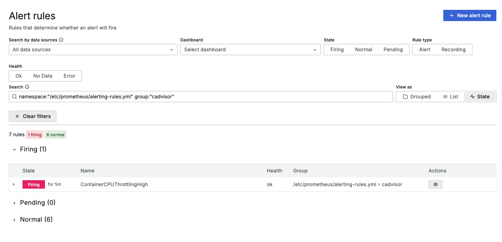
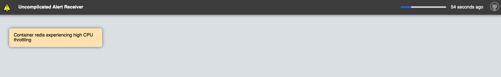
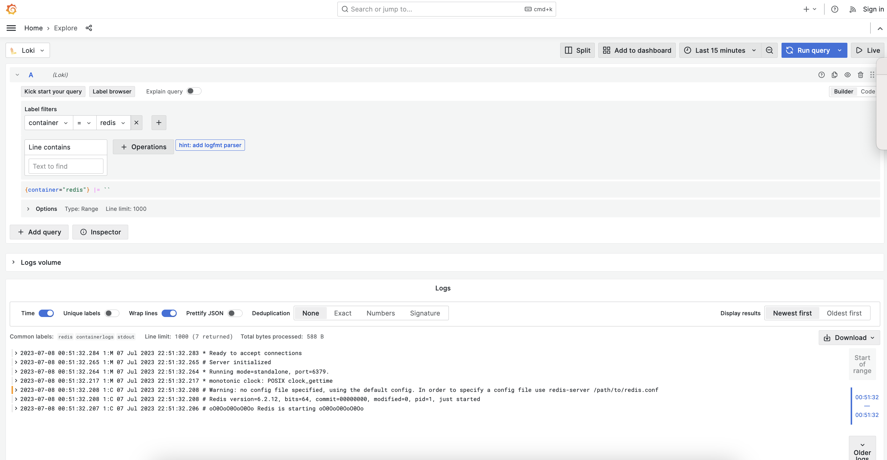
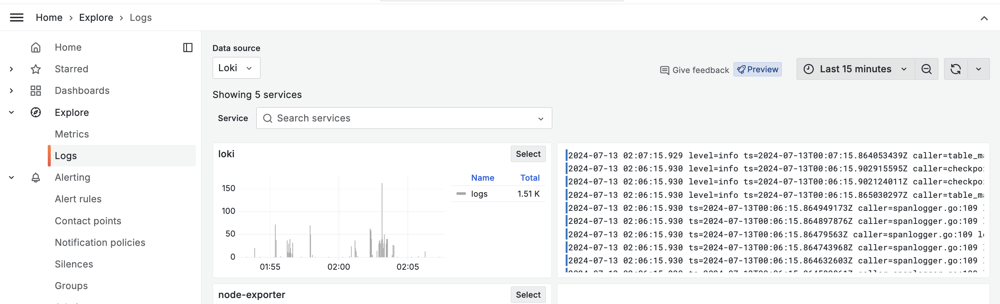

# docker-monitoring-stack-gpnc
Grafana Prometheus Node-Exporter cAdvisor Loki - Docker Monitoring Stack

## About

Get your monitoring stack up and running with one command using a Docker Compose stack featuring:

- **[Grafana](https://github.com/grafana/grafana)**: Dashboarding.
- **[Prometheus](https://github.com/prometheus/prometheus)**: Timeseries database for metrics.
- **[Node-Exporter](https://github.com/prometheus/node_exporter)**: Node metrics.
- **[cAdvisor](https://github.com/google/cadvisor)**: Container metrics.
- **[Alertmanager](https://github.com/prometheus/alertmanager)**: Alerting system.
- **[Uncomplicated Alert Receiver](https://github.com/jamesread/uncomplicated-alert-receiver)**: UI with Received Alerts.
- **[Loki](https://github.com/grafana/loki)**: Logs (including explore-logs).

## Makefile

[Note](https://docs.docker.com/compose/install/linux/): Due to `docker-compose` and the `compose` plugin, you might have one of the two installed. I have a `Makefile` that will detect which on you have installed.

You can list the targets using `make`.

## Boot

Boot the stack with docker compose (or `make up`):

```bash
docker-compose up -d
```

Ensure all containers are running:

```bash
docker-compose ps
```

The output should looke like this:

```bash
    Name                      Command                          State          Ports         
-----------------------------------------------------------------------------------------------------
cadvisor                      /usr/bin/cadvisor -logtostderr   Up (healthy)   8080/tcp              
grafana                       /run.sh                          Up             0.0.0.0:3000->3000/tcp
node-exporter                 /bin/node_exporter --path. ...   Up             9100/tcp              
prometheus                    /bin/prometheus --config.f ...   Up             0.0.0.0:9090->9090/tcp
alertmanager                  /bin/alertmanager --config ...   Up             0.0.0.0:9093->9093/tcp
loki                          /usr/bin/loki -conf ...          Up             0.0.0.0:3100->3100/tcp
promtail                      /usr/bin/promtail ...            Up
uncomplicated-alert-receiver  /app/uar                         Up             0.0.0.0:9094->8080/tcp
```

## Access Grafana

Access grafana on [Grafana Home](http://localhost:3000/?orgId=1) (or `make open`) and you should see the three dashboards that was provisioned:


Once you select the **Node Metrics** dashboard, it should look something like this:


When you select ["Alerting" and "Alert rules"](http://localhost:3000/alerting/list) you will find the recording and alerting rules:


We can expand the alerting rules:


And then we can view more detail on a alert rule:


When we see one of our alerts are in an alert state:



We will see them be displayed in Uncomplicated Alert Receiver:



And for our container metrics we can access the **Container Metrics** dashboard:


Then for our last dashboard, the **Container Log Search**, by default the metric panel will be collapsed, but to expand it for visibility it will look like this:


And we can also view our **Container Logs** in the explore section:



For discovering the **Logs** we can navigate to the Explore / Logs view:



## Endpoints

The following endpoints are available:

| Container                    | Internal Endpoint                         | External Endpoint     |
| ---------------------------- | ----------------------------------------- |---------------------- |
| Grafana                      | http://grafana:3000                       | http://localhost:3000 |
| Prometheus                   | http://prometheus:9090                    | http://localhost:9090 |
| Node-Exporter                | http://node-exporter:9100                 | http://localhost:9100 |
| cAdvisor                     | http://cadvisor:8080                      | N/A                   |
| Alertmanager                 | http://alertmanager:9093                  | http://localhost:9093 |
| Uncomplicated Alert Receiver | http://uncomplicated-alert-receiver:9094  | http://localhost:9094 |
| Loki                         | http://loki:3100                          | http://localhost:3100 |

## Cleanup

To remove the containers using docker compose (or `make clean`):

```bash
docker-compose down
```

## Stargazers over time

[](https://starchart.cc/ruanbekker/docker-monitoring-stack-gpnc)

## Resources

Heavily inspired from [this exporter guide](https://grafana.com/oss/prometheus/exporters/node-exporter/)
