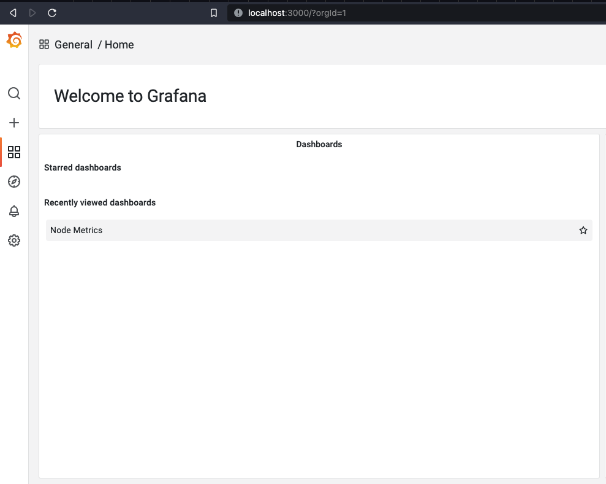
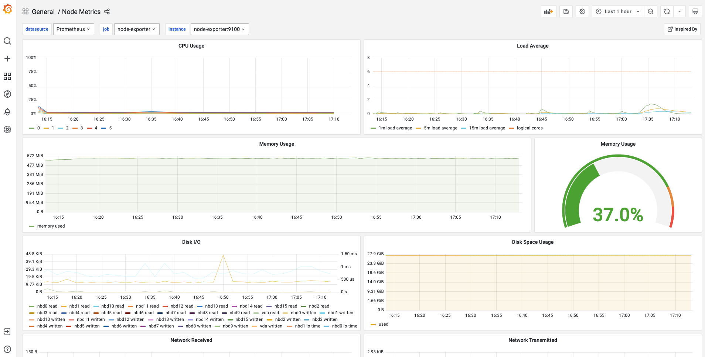
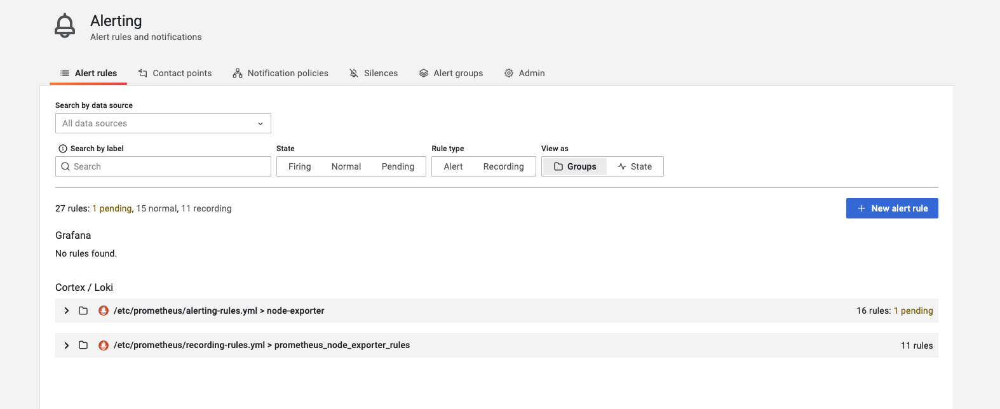
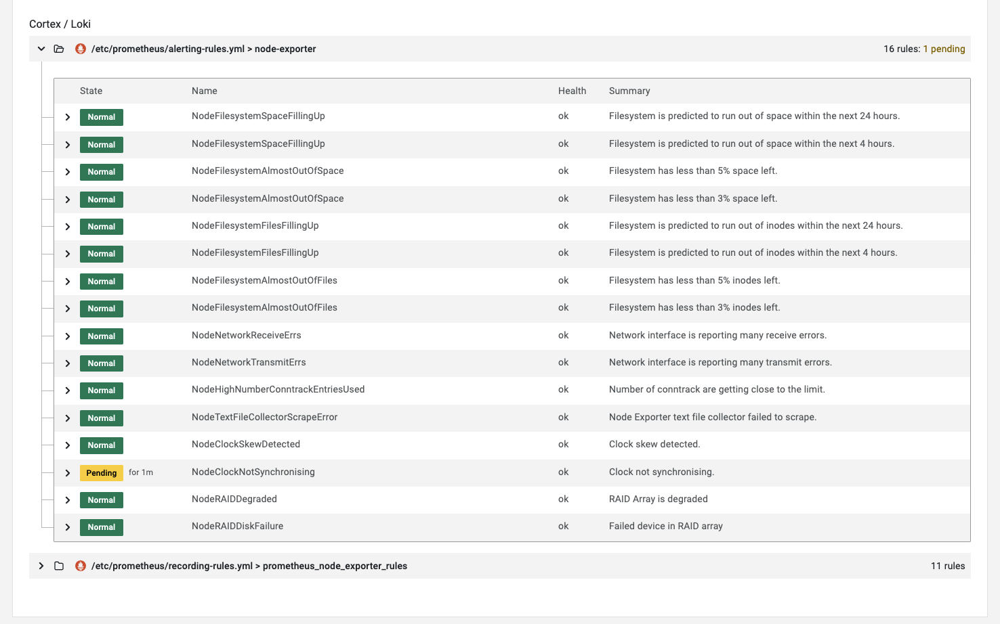
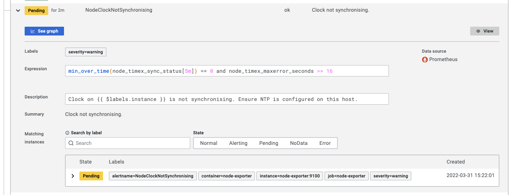
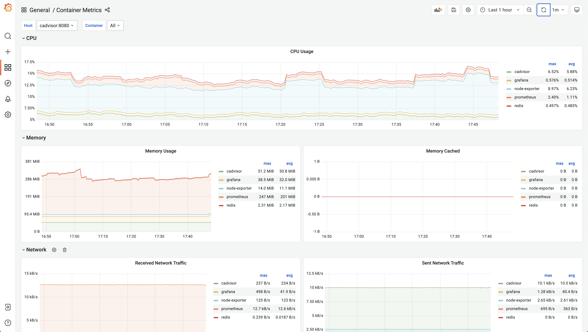

# docker-monitoring-stack-gpnc
Grafana Prometheus Node-Exporter cAdvisor - Docker Monitoring Stack

## Boot

Boot the stack with docker compose (or `make up`):

```bash
docker-compose up -d
```

Ensure all containers are running:

```bash
docker-compose ps
```

The output should looke like this:

```bash
    Name                   Command                  State               Ports         
--------------------------------------------------------------------------------------
cadvisor        /usr/bin/cadvisor -logtostderr   Up (healthy)   8080/tcp              
grafana         /run.sh                          Up             0.0.0.0:3000->3000/tcp
node-exporter   /bin/node_exporter --path. ...   Up             9100/tcp              
prometheus      /bin/prometheus --config.f ...   Up             0.0.0.0:9090->9090/tcp
alertmanager    /bin/alertmanager --config ...   Up             0.0.0.0:9093->9093/tcp
```

## Access Grafana

Access grafana on [Grafana Home](http://localhost:3000/?orgId=1) (or `make open`) and you should see the two dashboards that was provisioned:



Once you select the nodes dashboard, it should look something like this:



When you select ["Alerting" and "Alert rules"](http://localhost:3000/alerting/list) you will find the recording and alerting rules:



We can expand the alerting rules:



And then we can view more detail on a alert rule:



And for our container metrics we can access the **Container Metrics** dashboard:



## Endpoints

The following endpoints are available:

| Container      | Internal Endpoint         | External Endpoint     |
| -------------- | ------------------------- |---------------------- |
| Grafana        | http://grafana:3000       | http://localhost:3000 |
| Prometheus     | http://prometheus:9090    | http://localhost:9090 |
| Node-Exporter  | http://node-exporter:9100 | http://localhost:9100 |
| cAdvisor       | http://cadvisor:8080      | N/A                   |
| Alertmanager   | http://alertmanager:9093  | http://localhost:9093 |

## Cleanup

To remove the containers using docker compose (or `make clean`):

```bash
docker-compose down
```

## Stargazers over time

[](https://starchart.cc/ruanbekker/docker-monitoring-stack-gpnc)

## Resources

Heavily inspired from [this exporter guide](https://grafana.com/oss/prometheus/exporters/node-exporter/)
